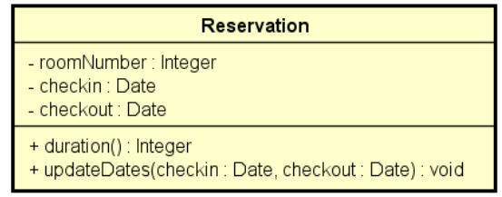

# Java: Exceptions study case 

Studying 3 possible solutions for exceptions on a common reservation hotel application. 

The content is: 

1. **Bad solution** ‼️❌: All the error treatment is in the main program. It's is not recommended because we must use the single responsability principle. So, the error treatment must be implemented on Reservation class, that defines the business rules. 

2. Not a good solution, but solves the problem ⚠️ 

3. Ideal solution using exceptions properly ✅

## Class design 

